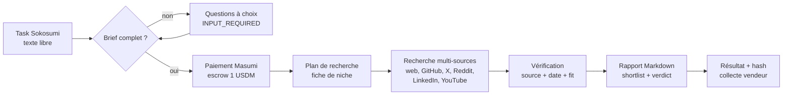
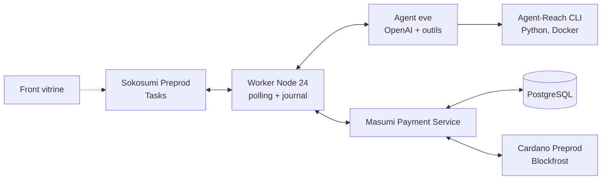

# Cardano Reach — Brief complet

> Document de référence du projet : quoi, pour qui, comment, comment on le pitche, où sont les pièges.
> Hackathon TOKEN2049 Origins (6-8 octobre 2026), track **Agentic Payments on Cardano** (Masumi / Sokosumi).
> Les affirmations techniques sont sourcées ; ce qui n'est pas vérifié est marqué **[À VÉRIFIER]**.

---

## 1. En une phrase

**Reach est un Coworker Sokosumi qui trouve, en quelques minutes, les bonnes entreprises à contacter :
des fournisseurs quand tu achètes, des clients quand tu vends. Chaque nom est sourcé, daté et justifié.**

> Pour une équipe achats ou commerciale B2B, Reach transforme un besoin exprimé en deux clics et une phrase
> en une shortlist de 5 à 10 entreprises vérifiées, pour lancer une demande de devis ou une prospection le jour même.

---

## 2. Pourquoi ce projet gagne cette track

### Ce que Masumi veut (sources : [guide](https://www.masumi.network/token2049), [critères](https://www.masumi.network/token2049/submission))

- Des **agents utiles, vivants sur le marketplace** Sokosumi Preprod, idéalement maintenus après le hack.
- Du **B2B web2** : « Think B2B: which team needs your expertise, and who pays for it? ». Le web3 n'est pas un critère.
- Leur propre exemple de job cite « compare supplier quotes » et « research an account » : on est pile dans leur cible.

### Comment on est jugés

| Critère | Ce qu'on montre |
| --- | --- |
| Qualité des résultats | Chaque ligne a une URL source et une date ; on explique comment on a vérifié (relecture des liens). |
| Utilité | Qui l'utilise (acheteur, commercial, fondateur), ce que l'agent décide, ce qui reste humain (contact, négociation). |
| Exécution fiable | Task réelle de bout en bout, reprise après crash sans refaire le travail ni facturer deux fois. |
| Paiement vérifié | Task → reçu vendeur → transaction de collecte sur Cardano Preprod, montant net reçu. |
| UI / UX (~20 %, d'après les orgas) | Personnalité, questions à choix, rapport lisible, front de présentation avec notre DA. |

**Tous les participants ont la même interface Sokosumi.** On se différencie sur trois choses : la personnalité de l'agent,
la qualité du rapport rendu, et la fluidité des questions de départ.

---

## 3. Le produit

### 3.1 Deux modes, un seul moteur

| Mode | L'utilisateur dit | Reach rend |
| --- | --- | --- |
| **Sourcing** (je cherche un fournisseur / prestataire) | « Trouve-moi qui peut usiner cette pièce en titane certifiée aéro » | Fournisseurs : capacité, certifications, zone, preuves, points de vigilance |
| **Leads** (je cherche des clients, façon [TamTam](https://www.tamtam.ai/)) | « Je vends des jets d'affaires d'occasion, trouve-moi des acheteurs » | Comptes cibles + signal « why now » daté + angle d'approche |

Même pipeline (§5) ; seuls la question de départ, les critères de score et le gabarit de sortie changent.

### 3.2 Niches couvertes

Une niche = une fiche `agent/niches/<slug>.md`. Ajouter une niche = ajouter une fiche, sans toucher au code.

| Slug | Exemples sourcing | Exemples leads | Preuves attendues |
| --- | --- | --- | --- |
| `crypto-defi` | auditeur smart contracts, market maker, infra RPC / oracle | protocoles qui ont besoin de liquidité, d'audit, d'intégration | audits publics, GitHub actif, TVL (DefiLlama), annonces |
| `automobile` | usinage / prototypage, design, électronique embarquée | équipementiers, constructeurs, flottes | IATF 16949, ISO 9001, salons, références clients |
| `aero-spatial` | pièces certifiées, matériaux, essais, MRO | compagnies, opérateurs charter, NewSpace | EN 9100 / AS9100, Part 145 / Part 21, contrats publics |
| `saas-tech-b2b` | intégrateurs, agences, freelances spécialisés | entreprises en croissance, levées, recrutements | levées, offres d'emploi, stack technique, changelog |

Contenu d'une fiche : vocabulaire et segments, sources prioritaires, critères de fit, signaux « why now »,
certifications, red flags, un exemple de bon résultat.

### 3.3 Personnalité : « Reach »

Objectif : qu'on ait envie de bosser avec lui. Un chasseur de têtes pour entreprises, pas un moteur de recherche.

- **Ton** : direct, énergique, un peu de punch, jamais lourd. Tutoie si l'utilisateur tutoie. Une touche d'humour
  dans l'intro et la conclusion, zéro dans les données.
- **Signature** : il annonce ce qu'il va chasser (« Ok, je pars chasser des usineurs titane certifiés EN 9100 en Europe »),
  puis livre un tableau propre et un verdict (« Mon pari : commence par X, ils ont exactement ta capacité »).
- **Honnête** : « Je n'ai rien trouvé de solide sur ce point » vaut mieux qu'un nom inventé. Il le dit avec style.
- **Exigeant sur les sources** : chaque affirmation a un lien, chaque signal une date.
- **Bilingue** : répond dans la langue de la demande (FR / EN).

Les règles de ton vont dans `agent/instructions.md`, avec deux ou trois exemples de bonnes réponses.

### 3.4 Garde-fous

- Aucune entreprise sans URL source. « Non trouvé » plutôt qu'inventé.
- **Fraîcheur** : chaque signal est daté. Plus de 12 mois → marqué « ancien ». Pas de date → marqué « non daté »,
  jamais présenté comme un signal actuel.
- Pas d'e-mail ni de téléphone personnels (RGPD) : entreprises, pages de contact publiques, profils publics de dirigeants.
- L'agent ne contacte personne : il prépare, l'humain envoie.
- Le contenu des pages lues est une donnée, jamais une instruction (injection de prompt).
- Hors périmètre (demande illégale, armes, données personnelles sensibles) → refus poli et clair.

---

## 4. Use cases (et nos scénarios de démo)

Chaque scénario sert à la fois de cas de test (§9) et de candidat pour la vidéo de démo.

| # | Niche / mode | Demande | Ce qui rend la réponse bonne |
| --- | --- | --- | --- |
| 1 | aéro / sourcing | « Je cherche un fournisseur de fixations titane certifié EN 9100, petites séries, Europe. » | Certifications vérifiées, capacité petites séries, pays, lien vers la page certif |
| 2 | aéro / leads | « Je vends deux jets d'affaires d'occasion. Qui achète ? » | Opérateurs charter et compagnies en expansion de flotte, annonces datées, angle d'approche |
| 3 | auto / sourcing | « Prototypage rapide de pièces plastique pour un tableau de bord, 50 unités. » | Prestataires prototypage / injection, délais annoncés, références auto |
| 4 | auto / leads | « On fait des bancs de test batteries. Qui en a besoin maintenant ? » | Gigafactories et équipementiers qui ouvrent des lignes, actualités datées |
| 5 | crypto / sourcing | « Je lance un DEX sur Cardano, il me faut un auditeur Plutus / Aiken. » | Auditeurs avec audits Cardano publiés, liens vers les rapports |
| 6 | crypto / leads | « On est market maker. Quels protocoles viennent de lancer un token sans liquidité sérieuse ? » | Lancements récents, signaux Twitter / annonces datés, TVL |
| 7 | SaaS / leads | « On vend un outil de conformité RGPD. Qui en a besoin ? » | Scale-ups qui lèvent ou recrutent un DPO, offres d'emploi datées |
| 8 | demande floue | « Trouve-moi des partenaires. » | Reach pose ses questions au lieu d'inventer |
| 9 | demande impossible | « Un fournisseur de moteurs de fusée à 10 € pièce. » | Reach dit ce qui est réaliste, sans fausse liste |

---

## 5. Comment on le résout

### 5.1 Pipeline



1. **Intake** : extraire `mode`, `niche`, `besoin`, `zone`, `volume`, `contraintes`. S'il manque `mode`, `niche`
   ou `besoin`, poser **une** question à choix ; deux allers-retours maximum, puis hypothèses explicites.
2. **Paiement** sur le brief final (cf. §6.3 : l'ordre compte).
3. **Plan** : la fiche de niche dit où chercher et quoi vérifier.
4. **Recherche** large, puis lecture des pages candidates.
5. **Vérification** : chaque candidat garde au moins une URL qui confirme l'affirmation, et une date.
6. **Score** /100 selon les critères de la niche ; on garde 5 à 10 lignes.
7. **Rapport** (format §6.4).

### 5.2 Sources

| Source | Outil | Sans login sur serveur | Usage |
| --- | --- | --- | --- |
| Recherche web | `web_search` d'eve (recherche OpenAI) ou Exa via Agent-Reach | oui | point d'entrée de toutes les niches |
| Pages web | `web_fetch` d'eve, Jina Reader via Agent-Reach | oui | sites, pages certifs, annuaires (Europages, Thomasnet), registres |
| GitHub | `gh` via Agent-Reach | oui (public) | crypto, SaaS : activité réelle |
| YouTube | `yt-dlp` via Agent-Reach | oui (risque bot-check sur IP datacenter) | salons, démos, interviews |
| RSS | feedparser | oui | actus sectorielles |
| Twitter / X | twitter-cli | **non** : cookies exportés (`TWITTER_AUTH_TOKEN`, `TWITTER_CT0`) | crypto surtout ; recherche marquée instable |
| Reddit | rdt-cli | **non** : cookie `reddit_session` ; IP serveur souvent en 403 | retours terrain, réputation |
| LinkedIn | pages publiques via Jina ; complet via `mcp-server-linkedin` | public oui, complet **non** | entreprises, recrutements |

Source : [Agent-Reach](https://github.com/Panniantong/Agent-Reach) (`docs/install.md`, `agent_reach/channels/*.py`).
OpenCLI (Facebook, Instagram, Reddit desktop) exige un Chrome de bureau : **inutilisable sur serveur**.

**Décision** : on branche Twitter, Reddit et LinkedIn avec des **comptes dédiés au projet** (jamais nos comptes perso),
un proxy résidentiel (~1 $/mois d'après Agent-Reach) et un débit faible. Le web, GitHub et la recherche restent
la base : si un canal social tombe pendant la démo, le rapport tient quand même.

### 5.3 Fraîcheur

Agent-Reach ne normalise pas les dates : elles viennent de chaque outil (`createdAt` côté X, `created_utc` Reddit,
`upload_date` YouTube, « Published Time » Jina) **[À VÉRIFIER par outil]**. Règle dans les instructions : chaque signal
porte une date lue dans la source ; sinon il est marqué « non daté » et ne compte pas comme signal « why now ».

---

## 6. UX : comment on se démarque dans une interface commune

### 6.1 Ce que Sokosumi permet vraiment (vérifié dans le code source)

Source : [masumi-network/sokosumi](https://github.com/masumi-network/sokosumi).

- **Task de Coworker** : statut `INPUT_REQUIRED` possible, via `POST /v1/tasks/{id}/events`
  `{"status":"INPUT_REQUIRED","comment":"…"}` avec la clé du Coworker. L'humain répond dans la boîte de commentaire
  (Markdown riche) ; le Coworker repasse lui-même la Task en `RUNNING`. **Pas de boutons** : l'événement de Task
  n'a aucun champ de schéma, la boîte de réponse est un éditeur de texte.
  (`apps/core/src/routes/v1/tasks/[id]/events/schema.ts`, composer de `apps/web/src/app/(app)/tasks/components/`)
- **Job Masumi (MIP-003)** : statut `awaiting_input` avec `input_schema`. L'UI Sokosumi rend un vrai formulaire :
  `radio` → boutons radio, `option` → menu déroulant, `boolean` → interrupteur, `checkbox` → case.
  Mais le formulaire est sur la page du Job, accessible par un lien depuis la Task, pas dans la Task.
  (`apps/web/src/components/job-input/inputs/*.tsx`, [MIP-003](https://github.com/masumi-network/masumi-improvement-proposals))
- Le CLI 1.0.4 n'a pas de commande pour `INPUT_REQUIRED` côté Coworker : on appelle `createTaskEvent` nous-mêmes.
- Aucun agent du marketplace n'utilise ces questions d'après la doc et GitHub. C'est un vrai différenciateur.

### 6.2 Notre choix

1. **Version livrée : questions dans la Task.** `INPUT_REQUIRED` + commentaire Markdown soigné, choix numérotés et
   emojis (« Réponds juste `1` ou `2` »). Côté eve, l'outil `ask_question` (2 à 3 options, réponse libre acceptée,
   [doc eve](https://github.com/vercel/eve/blob/main/docs/tools/human-in-the-loop.md)) produit la question ; le worker
   la traduit en `INPUT_REQUIRED` et renvoie la réponse avec `session.respond()`. Le worker de référence traite
   aujourd'hui `inputRequests` comme un échec : à modifier.
2. **Bonus si le temps le permet : vrais boutons radio** via l'API Standard MIP-003 (`/status` → `awaiting_input` avec
   `radio`). Plus lourd, formulaire hors de la Task, et la réponse arrive probablement en index (`[0]`) plutôt qu'en libellé
   **[À VÉRIFIER]**. À confirmer avec les devrels avant d'investir.
3. **Le rapport est notre écran principal** : titre, verdict en une ligne, tableau propre, badges de fraîcheur, brouillon
   de message prêt à copier. C'est ce que le juge voit le plus longtemps.
4. **Front vitrine** (notre DA) : landing + doc du fonctionnement + démo vidéo + lien vers le Coworker. Hors du chemin
   de paiement, donc sans risque pour l'exécution.

### 6.3 Ordre questions / paiement (important)

- Le paiement Masumi signe un `inputHash` : une réponse obtenue **après** la demande de paiement n'est pas couverte par l'escrow.
- Les délais de l'escrow courent pendant l'attente humaine. Règles MPS : `submitResultTime` ≥ maintenant + 15 min,
  `unlockTime` ≥ `submitResultTime` + 15 min, `payByTime` ≥ 5 min avant `submitResultTime`. La démo de référence prend
  `submitResultTime` = + 20 min : trop court pour attendre un humain.
  (`masumi-payment-service/src/routes/api/payments/index.ts`, `demo-agent-token2049/.../paid-task.mjs:57`)
- **Donc : questions d'abord, paiement sur le brief final, puis travail.** Si une question arrive malgré tout après
  paiement, on se contente d'hypothèses explicites plutôt que d'attendre.
- **[À VÉRIFIER avec les devrels]** : une Task en `INPUT_REQUIRED` avant le paiement reste-t-elle compatible avec le flux
  « Core finance l'escrow après débit des crédits » ?

### 6.4 Format du rapport

```markdown
# 🎯 Reach — 7 fournisseurs de fixations titane EN 9100 (Europe)

**Verdict** : commence par <Entreprise A> — petites séries, EN 9100 vérifiée, délai annoncé 4 semaines.

**Ton brief** : sourcing · aéro · fixations titane · petites séries · Europe
**Hypothèses** : pas de budget fourni, on vise le prototypage puis la petite série.

| # | Entreprise | Pays | Pourquoi elle | Preuve | Fraîcheur | Score |
|---|---|---|---|---|---|---|
| 1 | … | FR | … | [certif EN 9100](url) | 🟢 2026-08 | 92 |

**⚠️ Points de vigilance** : …
**✉️ Premier message (à copier)** : …
**🔍 Ce que je n'ai pas trouvé** : …
```

En mode leads, une colonne « Why now » (signal daté + lien) remplace « Preuve », et chaque ligne a un angle d'approche.

---

## 7. Architecture et stack



| Brique | Choix | Raison |
| --- | --- | --- |
| Agent | [Vercel eve](https://github.com/vercel/eve), `agent/instructions.md` + fiches de niche | Choix par défaut de Masumi, démo de référence dessus |
| Modèle | OpenAI direct : `openai("gpt-6.1-sol")` (`OPENAI_API_KEY`) ; `gpt-6-luna` pour itérer pas cher | cf. §8 |
| Outils | `web_search`, `web_fetch`, `ask_question`, outil custom `agent_reach` | Le `bash` d'eve auto-hébergé sans Docker tombe sur just-bash, qui ne lance pas Python |
| Worker | Node 24, part de la référence (`worker.mjs`, `paid-task.mjs`, `comments.mjs`, `worker-lock.mjs`) | Déjà vérifiée jusqu'à la Task payée |
| Paiement | Masumi Payment Service, Blockfrost Preprod | Imposé |
| Hébergement | **Serveur d'Armand** : PostgreSQL, MPS, worker, eve + Agent-Reach en Docker | Docker disponible = sandbox Python OK ; tout reste en ligne après le hack |
| Front | Vitrine statique avec notre DA | UX + doc |

Référence vérifiée par Masumi : [demo-agent-token2049, branche `live-demo-name-finder`](https://github.com/masumi-network/demo-agent-token2049/pull/2),
clonée dans `~/dev/demo-agent-token2049/`.

Exigences d'hébergement (guide Masumi) : pas de serverless pour le worker et MPS, redémarrage automatique, journaux de
Task et de paiement en stockage persistant, **un seul exécuteur par Coworker**, HTTPS entre worker et MPS s'ils sont séparés.

---

## 8. Coûts

Prix OpenAI ([pricing](https://developers.openai.com/api/docs/pricing), tier standard, par million de tokens) et coût
estimé d'une Task à ~150 k tokens en entrée / 8 k en sortie, sans cache :

| Modèle | Entrée | Sortie | Coût / Task | + 10 recherches web (0,01 $ l'appel) |
| --- | --- | --- | --- | --- |
| gpt-6-astra | 10 $ | 50 $ | ~1,90 $ | ~2,00 $ — plus cher que ce que rapporte la Task |
| **gpt-6.1-sol** | 2 $ | 10 $ | ~0,38 $ | **~0,48 $** |
| gpt-5.4-mini | 0,75 $ | 4,50 $ | ~0,15 $ | ~0,25 $ |
| gpt-6-luna | 0,10 $ | 0,50 $ | ~0,02 $ | ~0,12 $ |

Le cache de prompt réduit encore (~0,18 $ / Task en sol avec 70 % de cache, estimation). eve permet un plafond par
session : `limits.maxTokenCostUsdPerSession` (compté seulement si le coût est remonté, ce qui est le cas via AI Gateway).
Une Task paie 1 test USDM. **Recommandation** : `gpt-6.1-sol` pour la démo, `gpt-6-luna` pendant le développement.

---

## 9. Démo sans faille : stratégie de test

On tranche **4 scénarios de démo** dans §4 (un par niche, les deux modes représentés) et on les rejoue jusqu'à ce qu'ils
soient parfaits. Tout le reste du tableau sert de batterie de tests.

### 9.1 Jeu de référence (`tests/golden/`)

Pour chaque scénario : la demande, les réponses aux questions, et ce qu'on attend (critères, pas une liste figée).
Après chaque modif de prompt ou de fiche de niche, on rejoue tout et on relit à la main.

### 9.2 Grille de relecture d'un rapport

- Chaque lien ouvre une page qui confirme la ligne.
- Chaque signal a une date et la date est exacte.
- Aucune entreprise hors zone, hors niche ou fermée.
- Le verdict est défendable.
- Ton conforme à la personnalité, sans en faire trop.

### 9.3 Situations à tester

| Situation | Comportement attendu |
| --- | --- |
| Demande complète | Pas de question, rapport direct |
| Demande floue (#8) | Une question à choix, puis rapport |
| Réponse libre au lieu d'un numéro | Comprise quand même |
| Pas de réponse humaine | Hypothèses explicites ou abandon propre avant le délai |
| Demande impossible (#9) | Explique, ne fabrique rien |
| Hors niche | Le dit, propose la niche la plus proche ou travaille en générique avec avertissement |
| Canal social en panne (cookies expirés) | Rapport complet avec les autres sources, limite mentionnée |
| Page piégée (injection de prompt) | Ignorée |
| Crash du worker en pleine Task | Reprise depuis le journal, pas de double travail |
| Redémarrage pendant le paiement | Pas de double paiement ni double collecte |
| Langue EN | Rapport en anglais |

---

## 10. Le pitch

### Histoire (3 minutes)

1. **Problème** (20 s) : trouver le bon fournisseur ou le bon client B2B, c'est des jours de recherche, d'annuaires
   périmés et de LinkedIn. Les outils existants vendent des listes de contacts, pas des réponses.
2. **Reach** (20 s) : tu lui parles comme à un collègue. Il pose deux questions, part chasser sur le web, GitHub, X,
   Reddit, LinkedIn et YouTube, et revient avec 7 entreprises sourcées, datées et un verdict.
3. **Démo** (90 s, vidéo intégrée aux slides) : une Task aéro sourcing (fixations titane), une Task leads (vendre des jets).
   On montre la question à choix, le rapport, un lien cliqué qui confirme.
4. **Pourquoi Masumi / Cardano** (30 s) : Reach se fait payer à la Task, 1 USDM en escrow, résultat haché, collecte
   prouvée on-chain. Un agent qui gagne sa vie, sans abonnement ni clé d'API côté acheteur. Et demain, d'autres agents
   peuvent l'embaucher.
5. **Suite** (20 s) : nouvelles niches = nouveaux fichiers ; on garde l'agent en ligne après le hack, comme le demande Masumi.

### Messages clés

- « Pas une liste de contacts : une réponse sourcée. »
- « Il se fait payer à la tâche, en escrow, prouvé sur Cardano. »
- « Le web2 achète le résultat, pas la blockchain. »

### Livrables de soumission ([checklist](https://www.masumi.network/token2049/submission))

Repo + instructions de lancement, URL de l'agent déployé, Coworker ID, Task d'exemple et date de disponibilité,
Task ID complétée, hash de la transaction de collecte + lien explorer, adresse vendeur, unité du token USDM, montant net,
slides (.ppt ou .keynote sur Google Drive) **avec la vidéo de démo intégrée** (pas de démo live ni de lien vidéo externe).

---

## 11. Où il faut faire attention

1. **Une Task terminée ne prouve pas le paiement.** Seule la transaction de collecte confirmée compte
   (`sokosumi runtime receipt` → `settled: true`). Le délai avant collecte vient de `unlockTime` : prévoir de la marge.
2. **Questions avant paiement** (§6.3), sinon `inputHash` incohérent et délais dépassés.
3. **Un seul exécuteur par Coworker**, en local comme en hébergé : couper le local avant de lancer le serveur.
4. **Ne jamais recréer** un Vendor, un Coworker ou des wallets : réutiliser les IDs sauvegardés.
5. **Secrets** : clés et mnémoniques hors du chat, du code, des logs et des captures. Seed MPS avec sortie supprimée.
6. **Comptes sociaux** : comptes dédiés uniquement ; risque de ban et de violation des CGU en scraping ; la recherche X
   est instable. Le rapport ne doit pas dépendre d'eux.
7. **Hallucinations** : la qualité est jugée. Pas de lien = pas de ligne.
8. **Coût** : plafond par session dans eve, gpt-6-luna en développement.
9. **Disponibilité** : les juges testent après notre départ ; tout doit tourner sur le serveur, ordinateur éteint.
10. **Approbation du Workspace TOKEN2049** : la demander tôt, elle dépend d'un humain chez Masumi.

---

## 12. Priorités (dans l'ordre)

1. **Chemin payé de bout en bout avec un agent trivial** : Coworker → Task → escrow → résultat → collecte confirmée.
   C'est l'éliminatoire ; tout le reste est inutile sans lui.
2. **Agent de base sourcé** : instructions + personnalité + 4 fiches de niche + web_search / web_fetch, sur les 4 scénarios.
3. **Questions à choix** (`INPUT_REQUIRED`) avant paiement.
4. **Déploiement serveur** + test ordinateur éteint + demande d'accès au Workspace TOKEN2049.
5. **Agent-Reach** : web / GitHub / YouTube d'abord, puis X, Reddit, LinkedIn avec comptes dédiés.
6. **Batterie de tests** §9 et polissage du rapport.
7. **Front vitrine**, vidéo, slides.
8. Bonus : boutons radio via MIP-003.

Répartition en sessions parallèles : `docs/WORKSTREAMS.md`.

---

## 13. Questions ouvertes pour les devrels Masumi

1. Une Task peut-elle passer en `INPUT_REQUIRED` **avant** la demande de paiement, sans gêner le financement de l'escrow par Core ?
2. Pour des boutons dans la Task, existe-t-il (ou existera-t-il) un schéma d'entrée sur les événements de Task, ou faut-il passer par un Job MIP-003 ?
3. Quel `submitResultTime` recommandent-ils pour une Task de recherche de 5 à 15 minutes ?
4. Un Coworker peut-il afficher une description riche (Markdown, exemples de demandes) sur sa fiche marketplace ?
