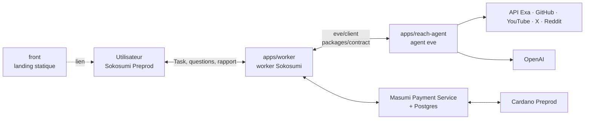

# Reach — shortlists B2B sourcées, payées sur Cardano

**Reach** est un Coworker payant sur [Sokosumi](https://sokosumi.com) Preprod (standard Masumi, 1 test USDM par Task)
qui trouve les bonnes entreprises à contacter : des **fournisseurs** quand on achète (mode `sourcing`) ou des
**clients** quand on vend (mode `leads`), par niche (aéro/spatial, automobile, crypto/DeFi, SaaS B2B). Si la demande
est floue, Reach pose une ou deux questions à choix, encaisse le paiement Masumi en escrow **avant** la recherche, puis
rend une shortlist de 5 à 10 entreprises où chaque ligne a un lien source et une date. Projet du hackathon TOKEN2049
Origins, track Agentic Payments on Cardano.

## Architecture



Parcours d'une Task : demande → questions éventuelles (`INPUT_REQUIRED`) → brief → paiement Masumi → recherche
parallèle multi-canaux → rapport Markdown sourcé → collecte du paiement on-chain.

## Structure du repo

| Chemin | Contenu |
| --- | --- |
| `apps/reach-agent/` | agent eve 0.71.0 : instructions, fiches de niche, outils, moteur de recherche (`src/search/`), scripts |
| `apps/worker/` | worker Sokosumi + paiement Masumi (à venir) |
| `packages/contract/` | protocole worker ↔ agent, gelé (voir `docs/CONTRACT.md`) |
| `front/` | landing statique Nuxt 4 + Tailwind 4 |
| `docs/` | plan, roadmap, tâches, onboarding, devlog, état de chaque app |
| `.github/` | CI, Dependabot, template de PR |
| `.githooks/` | hook `pre-commit` gitleaks |

Un `package.json` + lockfile par app (pas de workspaces), TypeScript strict.

## Lancer en local

Prérequis : Node 24, pnpm (version épinglée dans `front/package.json`, via Corepack).

### Agent

```bash
cd apps/reach-agent
npm ci
cp .env.example .env.local   # puis renseigner les clés (OPENAI_API_KEY, EXA_API_KEY…)
npm run dev                  # eve sur http://127.0.0.1:21949
npm run research -- --text "Trouve-moi des fournisseurs de fixations titane EN 9100." --answer 1
npm run typecheck
npm test
npm run golden               # scénarios bout en bout (consomme des crédits API)
npm run bench -- "requête"   # latence et hits par canal
```

`npm run research` simule le worker sans Sokosumi. Image de prod : `docker build -f apps/reach-agent/Dockerfile -t
reach-agent .` depuis la racine (port 3000).

### Front

```bash
cd front
pnpm install
pnpm dev        # http://localhost:3000
pnpm lint       # Biome (lint + format)
pnpm generate   # site statique dans .output/public
```

### Worker

À venir dans `apps/worker/` (portage TS du worker de référence Masumi, voir `docs/PLAN.md` §B2).

## Déployer

Cible : un VPS avec Docker Compose (Postgres, Masumi Payment Service, agent, worker, Caddy) ; seule
`https://REACH_DOMAIN/agent-api/` est publique. Le front est un site statique (`pnpm generate`). Détails et état :
`docs/ROADMAP.md`, `docs/TASKS.md`.

## CI et secrets

La CI GitHub Actions (`.github/workflows/ci.yml`) tourne sur chaque PR et sur `main` :

- `secrets` : gitleaks sur tout l'historique (règles dans `.gitleaks.toml`) ;
- `agent` : `npm run typecheck` + `npm test` ;
- `front` : `pnpm lint` (Biome) + `pnpm generate`.

Dependabot (`.github/dependabot.yml`) ouvre chaque semaine une PR groupée par app (agent, front) et pour les actions
GitHub.

Hook local, à activer une fois par clone :

```bash
git config core.hooksPath .githooks
brew install gitleaks
```

Le hook scanne les fichiers indexés avant chaque commit ; sans gitleaks installé, il prévient et laisse passer.
Ne jamais commiter de `.env*` (sauf `.env.example`), de clé ni de mnémonique.

## Documentation

- [`BRIEF.md`](BRIEF.md) : produit, cible, pitch, pièges
- [`docs/PLAN.md`](docs/PLAN.md) : plan d'implémentation, lots, jalons M0-M6
- [`docs/ROADMAP.md`](docs/ROADMAP.md) : démo → e-mail entreprise → envoi validé
- [`docs/TASKS.md`](docs/TASKS.md) : qui fait quoi
- [`docs/ONBOARDING.md`](docs/ONBOARDING.md) : reprendre le projet en 10 minutes
- [`docs/CONTRACT.md`](docs/CONTRACT.md) : contrat worker ↔ agent
