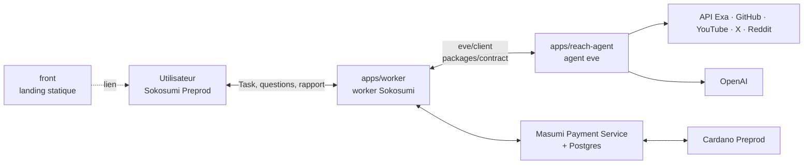

# Richard — shortlists B2B sourcées, payées sur Cardano

**Richard** est un Coworker payant sur [Sokosumi](https://sokosumi.com) Preprod (standard Masumi, 1 test USDM par Task)
qui trouve les bonnes entreprises à contacter : des **fournisseurs** quand on achète (mode `sourcing`) ou des
**clients** quand on vend (mode `leads`), par niche (aéro/spatial, automobile, crypto/DeFi, SaaS B2B). Si la demande
est floue, Richard pose une ou deux questions à choix, encaisse le paiement Masumi en escrow **avant** la recherche, puis
rend une shortlist de 5 à 10 entreprises où chaque ligne a un lien source et une date. Projet du hackathon TOKEN2049
Origins, track Agentic Payments on Cardano.

## On-chain proof (Cardano Preprod)

Every Task is paid **1 test USDM**, locked in the Masumi escrow before the research starts and collected by the seller
after the result hash is submitted. Five paid Tasks have been completed and **settled**: the Sokosumi receipt of each
(`sokosumi --preprod runtime receipt <task>`) returns `settled: true`, `onChainState: Withdrawn` and the collection
transaction below. The net amount was then measured independently on-chain (public Koios API, `tx_info`): in each
collection, 1 tUSDM leaves the escrow contract and the seller wallet ends **+1 tUSDM**.

| # | Task (Sokosumi ID) | Workspace | Request | Collection tx (settled) | Seller net |
| --- | --- | --- | --- | --- | --- |
| 1 | `01a1133e-6407-707b-8753-34abd515c437` | Personal (M2) | EN 9100 titanium fastener suppliers, Europe | [`b888b4a8…9a458a80`](https://preprod.cardanoscan.io/transaction/b888b4a851fe3da9c4e9b5eb1c11813d4b85cba95679d7a70968b95f9a458a80) · 2026-10-06 23:12 UTC | +1 tUSDM |
| 2 | `01a114fb-948e-777f-b913-bb81d663e2fc` | TOKEN2049 | Customers for an AI support-reply tool, FR/BE | [`e397d7cb…b2671ce0`](https://preprod.cardanoscan.io/transaction/e397d7cbfc9714bb7431de0c41d87f7147a2acf57cca2ab1a66beeabb2671ce0) · 2026-10-07 07:21 UTC | +1 tUSDM |
| 3 | `01a11502-4909-75eb-95c1-3dd312306b77` | TOKEN2049 | Identify a Cardano developer advocate (x402) | [`d71dabe2…b9f620d3`](https://preprod.cardanoscan.io/transaction/d71dabe2daa482143aff391e97d300ce89ce2bf98b649859536def7bb1f620d3) · 2026-10-07 07:27 UTC | +1 tUSDM |
| 4 | `01a115ac-fefa-7496-afc3-d6aa5e800358` | TOKEN2049 | Senior F1 aerodynamicist available soon (showcase) | [`3db7f0bb…cdc27c9`](https://preprod.cardanoscan.io/transaction/3db7f0bbdebbca3d79a3b479c06397351314389c9afe950d1faa594e9cdc27c9) · 2026-10-07 10:31 UTC | +1 tUSDM |
| 5 | `01a115ba-1456-709f-916e-4cd1304ef21e` | TOKEN2049 | Vague request → 2 questions → suppliers | [`74882307…27607012`](https://preprod.cardanoscan.io/transaction/74882307da0f8da92eeb2a36e8ef2eb5d5bf090849350f4678451f6c27607012) · 2026-10-07 10:51 UTC | +1 tUSDM |

Full hashes (also viewable on [AdaStat Preprod](https://preprod.adastat.net/)):

```text
b888b4a851fe3da9c4e9b5eb1c11813d4b85cba95679d7a70968b95f9a458a80
e397d7cbfc9714bb7431de0c41d87f7147a2acf57cca2ab1a66beeabb2671ce0
d71dabe2daa482143aff391e97d300ce89ce2bf98b649859536def7bb1f620d3
3db7f0bbdebbca3d79a3b479c06397351314389c9afe950d1faa594e9cdc27c9
74882307da0f8da92eeb2a36e8ef2eb5d5bf090849350f4678451f6c27607012
```

| Item | Value |
| --- | --- |
| Coworker | Richard · `01a11272-c015-748f-9f1a-cfd1e504c497` (vendor `01a11272-9017-740c-9f1b-cd446384ccb4`) |
| TOKEN2049 workspace access | `GRANTED` (access `01a112d0-23c1-769b-a29f-3dfc57945a85`), `taskSeatEligible: true` |
| Seller address | `addr_test1qz4gqkvqw7svg6n7rv65g4tndjg3u52q6nzcuawrqmeg8cwcehy9xse720ln882ese7sc5n5xk92ylr6k6ykdu9r0nhsyzkrw5` |
| Escrow contract (Masumi V2, Preprod) | `addr_test1wzs4e6wc95hkwezlccjw9mdvq0r0rsgx6zk34avptga3ftgn37w4g` |
| Token (test USDM) | policy `16a55b2a349361ff88c03788f93e1e966e5d689605d044fef722ddde`, asset `0014df10745553444d` |
| Payment flow | brief clear → `Payment requested: 1 test USDM` → escrow locked (MPS `FundsLocked`) → research → result hash submitted → Task `COMPLETED` → collection after unlock (`Withdrawn`) |

The worker never runs the model before the escrow is confirmed, hashes the exact delivered report
(`apps/worker/src/hash.ts`) and verifies settlement against the Core receipt, MPS and the chain
(`apps/worker/src/settlement.ts`).

## Architecture



Parcours d'une Task : demande → questions éventuelles (`INPUT_REQUIRED`) → brief → paiement Masumi → recherche
parallèle multi-canaux → rapport Markdown sourcé → collecte du paiement on-chain.

## Structure du repo

| Chemin | Contenu |
| --- | --- |
| `apps/reach-agent/` | agent eve 0.71.0 : instructions, fiches de niche, outils, moteur de recherche (`src/search/`), scripts |
| `apps/worker/` | worker Sokosumi (questions avant paiement, M1 prouvé) + paiement Masumi, API standard MIP-003 |
| `packages/contract/` | protocole worker ↔ agent, gelé (voir `docs/CONTRACT.md`) |
| `front/` | landing statique Nuxt 4 + Tailwind 4 |
| `docs/` | plan, roadmap, tâches, onboarding, devlog, état de chaque app |
| `.github/` | CI, Dependabot, template de PR |
| `.githooks/` | hook `pre-commit` gitleaks |

Un `package.json` + lockfile par app (pas de workspaces), TypeScript strict.

## Lancer en local

Prérequis : Node 24, pnpm (version épinglée dans `front/package.json`, via Corepack).

### Agent

```bash
cd apps/reach-agent
npm ci
cp .env.example .env.local   # puis renseigner les clés (OPENAI_API_KEY, EXA_API_KEY…)
npm run dev                  # eve sur http://127.0.0.1:21949
npm run research -- --text "Trouve-moi des fournisseurs de fixations titane EN 9100." --answer 1
npm run typecheck
npm test
npm run golden               # scénarios bout en bout (consomme des crédits API)
npm run bench -- "requête"   # latence et hits par canal
```

`npm run research` simule le worker sans Sokosumi. Image de prod : `docker build -f apps/reach-agent/Dockerfile -t
reach-agent .` depuis la racine (port 3000).

### Front

```bash
cd front
pnpm install
pnpm dev        # http://localhost:3000
pnpm lint       # Biome (lint + format)
pnpm generate   # site statique dans .output/public
```

### Worker

```bash
cd apps/worker
npm ci
cp .env.example .env.local   # COWORKER_ID, SOKOSUMI_COWORKER_API_KEY (clé runtime du Coworker)
npm start                    # mode gratuit ; agent requis sur EVE_URL (http://127.0.0.1:21949)
npm run typecheck
npm test
```

Le worker liste les Tasks du Coworker avec sa clé runtime, pose les questions de cadrage en `INPUT_REQUIRED` avant tout
paiement, puis lance la recherche et livre le rapport ; un journal par Task (`.local/tasks/`) permet la reprise après
crash sans doublon. Mode payé (`PAID_TASKS_ENABLED=true`) : escrow Masumi entre le brief et la recherche, preuve de
collecte via Blockfrost ; `npm run registration -- key|register|status` et `npm run agent-api` (MIP-003).
Procédure M2 et preuves : `docs/state/worker.md`.

## Déployer

Cible : un VPS avec Docker Compose (Postgres, Masumi Payment Service, agent, worker, Caddy) ; seule
`https://REACH_DOMAIN/agent-api/` est publique. Le front est un site statique (`pnpm generate`). Détails et état :
`docs/ROADMAP.md`, `docs/TASKS.md`.

## CI et secrets

La CI GitHub Actions (`.github/workflows/ci.yml`) tourne sur chaque PR et sur `main` :

- `secrets` : gitleaks sur tout l'historique (règles dans `.gitleaks.toml`) ;
- `agent` : `npm run typecheck` + `npm test` ;
- `front` : `pnpm lint` (Biome) + `pnpm generate` ;
- `worker` : `npm run typecheck` + `npm test`.

Dependabot (`.github/dependabot.yml`) ouvre chaque semaine une PR groupée par app (agent, worker, front) et pour les
actions GitHub ; les majeures de `@types/node` sont ignorées (le runtime est Node 24).

Hook local, à activer une fois par clone :

```bash
git config core.hooksPath .githooks
brew install gitleaks
```

Le hook scanne les fichiers indexés avant chaque commit ; sans gitleaks installé, il prévient et laisse passer.
Ne jamais commiter de `.env*` (sauf `.env.example`), de clé ni de mnémonique.

## Documentation

- [`BRIEF.md`](BRIEF.md) : produit, cible, pitch, pièges
- [`docs/PLAN.md`](docs/PLAN.md) : plan d'implémentation, lots, jalons M0-M6
- [`docs/ROADMAP.md`](docs/ROADMAP.md) : démo → e-mail entreprise → envoi validé
- [`docs/TASKS.md`](docs/TASKS.md) : qui fait quoi
- [`docs/ONBOARDING.md`](docs/ONBOARDING.md) : reprendre le projet en 10 minutes
- [`docs/CONTRACT.md`](docs/CONTRACT.md) : contrat worker ↔ agent
