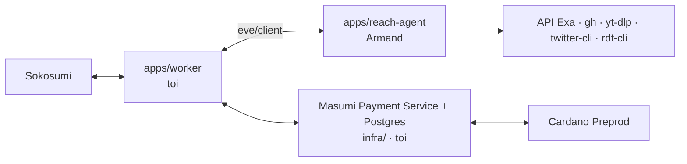

# Onboarding — ce qui est fait, comment ça marche, ce qui reste

Doc pour reprendre le projet en 10 minutes. Répartition à jour : `docs/TASKS.md`. Détails produit : `BRIEF.md`. Plan complet et jalons : `docs/PLAN.md`.
Contrat worker ↔ agent : `docs/CONTRACT.md`. Historique des décisions : `docs/DEVLOG.md`. Suite : `docs/ROADMAP.md`.

## 1. Le projet

**Reach** est un Coworker payant sur Sokosumi Preprod (1 test USDM par Task, paiement Masumi sur Cardano Preprod).
Il trouve les bonnes entreprises à contacter : des **fournisseurs** (mode `sourcing`) ou des **clients**
(mode `leads`), par niche (aéro/spatial, automobile, crypto/DeFi, SaaS B2B). Chaque ligne du rapport a un lien source
et une date.

Parcours d'une Task :

1. L'utilisateur écrit sa demande sur Sokosumi.
2. Si elle est floue, Reach pose 1 ou 2 questions à choix (`INPUT_REQUIRED`).
3. Brief clair → paiement Masumi (escrow) **avant** la recherche.
4. Recherche parallèle (web, LinkedIn, GitHub, YouTube) + lecture des pages.
5. Rapport Markdown : verdict, tableau sourcé et daté, vigilance, premier message à copier.
6. Résultat soumis, collecte du paiement on-chain.

## 2. Architecture et qui fait quoi



| Chemin | Propriétaire | État |
| --- | --- | --- |
| `apps/reach-agent/` | Armand | **fait** (étape 0 + lot A, mergé) |
| `packages/contract/`, `docs/CONTRACT.md` | partagé, gelé | **fait** |
| `apps/worker/` | toi | à faire (lot B) |
| `infra/` | Armand | à faire (VPS, Docker, Postgres + MPS) |
| `front/` | toi (déploiement : Armand) | **fait** (landing statique, PR #7), pas encore déployée |

Règles : un `package.json` + lockfile par app (pas de workspaces npm), TypeScript strict sans `any`, branches
`feat/worker-<sujet>` pour toi, PR squash sur `main`, personne ne pousse sur `main`. Armand passe toujours par une
branche + PR et voit avec Noé avant de merger ou de pousser sur `main`. Toute modif du contrat = PR qui
ne contient que le contrat, relue par l'autre.

## 3. Le contrat (ce dont tu as besoin pour le worker)

Le worker ne parle à l'agent que via `eve/client`. Une Task = une session eve.

```ts
import { Client } from "eve/client";
import { extractBrief, phaseMessage, MAX_REPORT_BYTES } from "../../../packages/contract/src/index.ts";

const client = new Client({ host: process.env.EVE_URL, auth: { basic: { username, password } } });
const { session, response } = await client.sessions.create({ message: phaseMessage("INTAKE", task.description) });
let result = await response.result();

const question = result.inputRequests.find((r) => r.kind === "question");
if (question) {
  // → INPUT_REQUIRED sur Sokosumi avec question.prompt et question.options
  // puis, à la réponse humaine :
  result = await (await session.respond([{ requestId: question.requestId, optionId: question.options![0]!.id }])).result();
  // ou { requestId, text: "réponse libre" }
} else {
  const brief = extractBrief(result.message ?? ""); // lève "No brief block" / "Invalid brief: <champ>"
  // → paiement, puis :
  const report = await (await session.send(phaseMessage("RESEARCH", "```json\n" + JSON.stringify(brief, null, 2) + "\n```"))).result();
}
```

Pièges vérifiés :

- **`result.status === "waiting"` ne veut pas dire « question »** : c'est aussi le statut d'une session au repos après
  une réponse finale. Teste uniquement `inputRequests`.
- Si `extractBrief` échoue, une seule relance : `session.send("Réponds uniquement avec le bloc JSON Brief.")`.
- Persiste `session.state` (`{ sessionId, streamIndex }`) après chaque échange ; reprise avec
  `client.sessions.attach(sessionId, { streamIndex })`.
- Le rapport commence par `# ` et fait au plus `MAX_REPORT_BYTES` (900 000 octets).
- Implémentation de référence de cette boucle : `apps/reach-agent/src/simulator.ts`.

## 4. L'agent (ce qui est fait)

`apps/reach-agent/` — eve 0.71.0, modèle OpenAI (`REACH_MODEL`, défaut `gpt-6-luna`).

| Fichier | Rôle |
| --- | --- |
| `agent/agent.ts` | modèle, raisonnement, plafonds de tokens ; `openai()` si `OPENAI_API_KEY`, sinon `chatgpt()` (local) |
| `agent/instructions.md` | personnalité, garde-fous, procédure INTAKE / RESEARCH / FOLLOWUP, format du rapport |
| `agent/instructions/niche-*.md` | 4 fiches de niche, toujours chargées |
| `agent/tools/ask_question.ts` | question à choix → `inputRequests` côté worker |
| `agent/tools/reach_search.ts` | 6 à 12 requêtes multi-canaux en parallèle, 25 s max |
| `agent/tools/read_pages.ts` | lecture parallèle de pages, 20 s max |
| `agent/tools/web_search.ts` | recherche OpenAI de secours (seulement avec `openai()`) |
| `agent/channels/eve.ts` | auth Basic (`ROUTE_AUTH_BASIC_USER` / `_PASSWORD`) ; `localDev()` sous `eve dev` |
| `src/search/` | moteur : canaux, cache disque, limiteur, échéances, garde SSRF |
| `src/phase.ts` | interdit la recherche en `PHASE: INTAKE` (avant paiement) |
| `scripts/research.ts` | simulateur de worker (sans Sokosumi) |
| `scripts/golden.ts`, `tests/golden/cases.json` | 9 scénarios du brief, exit 1 si un cas échoue |
| `scripts/bench-search.ts` | latence et taux de hits datés par canal |
| `Dockerfile` | image de prod (contexte de build = racine du repo), port 3000 |

Lancer en local :

```bash
export PATH=$HOME/.nvm/versions/node/v24.21.0/bin:$PATH
cd apps/reach-agent && npm ci
npm run dev                         # eve sur http://127.0.0.1:21949 (EVE_URL)
node scripts/research.ts --text "Trouve-moi des partenaires." --answer 1 --answer "aéronautique, Europe"
npm test                            # 15 tests
npm run golden                      # 9 scénarios bout en bout
```

Prod (sur le VPS, à brancher dans `infra/docker-compose.yml`) :

```bash
docker build -f apps/reach-agent/Dockerfile -t reach-agent .
# env : OPENAI_API_KEY, REACH_MODEL, ROUTE_AUTH_BASIC_USER, ROUTE_AUTH_BASIC_PASSWORD, EXA_API_KEY, GH_TOKEN
# volumes : /app/.eve/.workflow-data (sessions durables), /app/.local/cache
# côté worker : EVE_URL=http://reach-agent:3000 + mêmes identifiants Basic
```

`eve start` refuse de démarrer sans les identifiants Basic, et répond 401 sans / avec de mauvais identifiants.

## 5. État vérifié et limites

- M0 validé : question → brief → rapport.
- Cas réel (fixations titane EN 9100) : 0 question, recherche en ~57 s, fournisseurs réels avec liens et dates.
- 22 tests verts, `eve build` OK, auth Basic vérifiée.
- Golden : jusqu'à 8/9 avant l'épuisement du MCP Exa gratuit. Web, LinkedIn et lecture de pages passent maintenant par
  l'API Exa (`/search`, `/contents`) : **il faut `EXA_API_KEY`** (https://dashboard.exa.ai/api-keys).
- X et Reddit branchés (twitter-cli, rdt-cli) ; ils s'activent dès qu'un compte dédié est configuré.
- YouTube bloqué sur le poste d'Armand (à tester sur le VPS).
- Image Docker jamais construite (pas de Docker en local).

## 6. Ce qui te revient (lot B, détail dans `docs/PLAN.md`)

1. **B1** : compte Sokosumi Preprod, Vendor, Coworker ; MPS + Postgres sur le VPS ; wallet vendeur financé.
2. **B2** : porter le worker de référence (`~/dev/demo-agent-token2049/live-team-names-20261006/`) en TS strict
   dans `apps/worker/src/`. À cloner d'abord : `git clone -b live-demo-name-finder
   https://github.com/masumi-network/demo-agent-token2049 ~/dev/demo-agent-token2049`.
3. **B3** : intake `INPUT_REQUIRED` avant paiement (machine de phases du plan, section 3 ci-dessus pour le code eve).
4. **M1** Task gratuite avec question → **M2** Task payée, collecte confirmée on-chain (**éliminatoire**) →
   **M4** déploiement serveur.

Un seul exécuteur de Tasks à la fois : ton worker. Armand ne lance jamais de worker, il teste avec `research.ts`.

## 7. Front

`front/` : landing statique Nuxt 4 + Tailwind 4, gérée avec **pnpm** (lockfile `pnpm-lock.yaml` ; `pnpm-workspace.yaml`
n'autorise que le script d'installation d'esbuild).

```bash
cd front && pnpm install
pnpm dev        # http://localhost:3000
pnpm generate   # site statique dans .output/public (front/dist en est un lien, ignoré par Git)
```

Sections : hero, exemple de Task, deux modes, « how it works », paiement Masumi, footer. Images dans
`front/public/images/` (WebP). Liens « Open Sokosumi » génériques : à remplacer par l'URL du Coworker.
